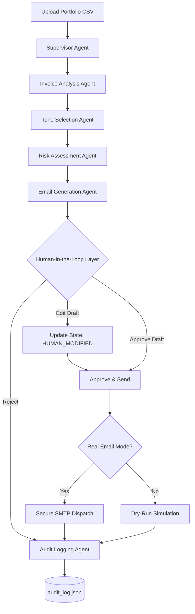
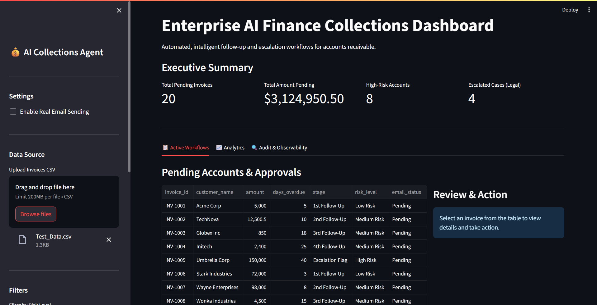
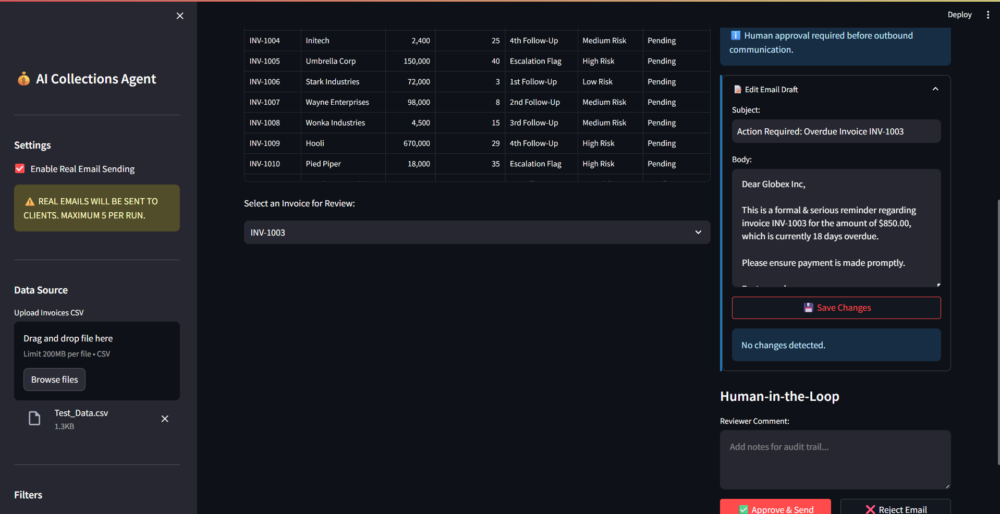
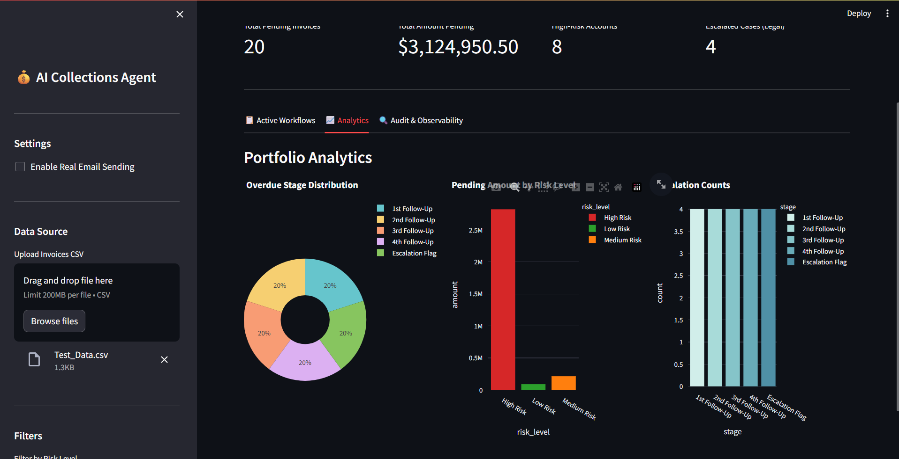
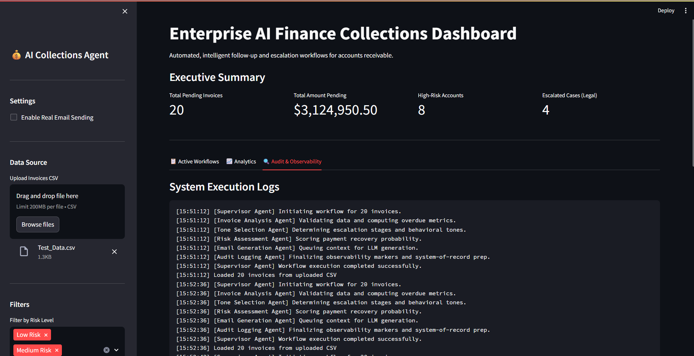

<div align="center">

# 🏛️ Finance Credit Follow-Up Email Agent
**AI-powered autonomous collections workflow with human-in-the-loop governance and adaptive escalation intelligence.**

[](https://www.python.org/)
[](https://streamlit.io/)
[](https://python.langchain.com/)
[](https://groq.com/)
[](https://opensource.org/licenses/MIT)

</div>

---

## 1. Project Overview

In enterprise accounts receivable, managing overdue invoices is a highly sensitive and manual operation. Finance teams spend countless hours drafting personalized collection emails, analyzing payment histories, and determining the appropriate escalation tone without damaging client relationships. 

The **Finance Credit Follow-Up Email Agent** solves this problem by introducing a lightweight, multi-agent AI architecture to the collections workflow. It analyzes overdue portfolios in real-time, autonomously scores payment risk, intelligently selects the correct escalation tone based on corporate matrices, and generates highly personalized communication—while strictly requiring **human-in-the-loop (HITL)** approval before any outbound SMTP dispatch. This ensures maximum efficiency without sacrificing financial compliance or client trust.

## Live Demo

🔗 Deployed Application: [https://Finance Credit Follow-Up Email Agent.streamlit.app](https://17atishay-travel-email-project-app-2nqcpl.streamlit.app/)


## 2. Key Features

- 🧠 **Multi-Agent Architecture**: Segregated responsibilities across Supervisor, Analysis, Risk, Tone, and Generation agents.
- ✉️ **AI-Generated Personalized Emails**: Dynamically context-aware emails tailored to the specific invoice, amount, and delay.
- 📊 **Escalation Intelligence**: Strict algorithmic mapping of overdue days to behavioral tones (Warm, Firm, Stern).
- ⚠️ **Payment Risk Scoring**: Intelligent evaluation yielding Low, Medium, or High risk categorizations with reasoning.
- 👨‍💻 **Human-in-the-Loop Workflow**: Mandatory reviewer approval with inline UI draft editing and side-by-side comparison.
- 📬 **Secure SMTP Delivery**: Built-in real email dispatch with TLS encryption and robust timeout handling.
- 🛡️ **Dry-Run Safety Mode**: Safe simulation mode enabled by default to prevent accidental outbound emails.
- 📜 **Enterprise Audit Logging**: Immutable, timestamped JSON records of all AI states, human edits, and delivery statuses.
- 📈 **Observability Dashboard**: Streamlit-powered analytics, execution logs, and workflow management interfaces.

---

## 3. Demo Workflow

```text
[1] Upload CSV ➔ [2] Analyze Invoices ➔ [3] Assess Risk ➔ [4] Select Tone 
       ➔ [5] Generate Draft ➔ [6] Human Review & Edit ➔ [7] Approve ➔ [8] Dispatch ➔ [9] Audit
```

---

## 4. Multi-Agent Architecture

This project utilizes a **Plan-and-Execute** multi-agent design pattern. Rather than relying on a single monolithic prompt, the workflow is distributed among specialized agents, reducing hallucination risk and enforcing Separation of Concerns (SoC).

- **Supervisor Agent**: Orchestrates the execution pipeline, passing state securely between specialized workers.
- **Invoice Analysis Agent**: Validates deterministic financial data and computes fundamental metrics (e.g., days overdue).
- **Risk Assessment Agent**: Evaluates the probability of non-payment using historical data, invoice amounts, and current delays.
- **Tone Selection Agent**: Maps the overdue timeline to the corporate Tone Escalation Matrix.
- **Email Generation Agent**: Synthesizes the final communication via LangChain & Groq Llama 3, constrained by the outputs of prior agents.
- **Audit Logging Agent**: Captures the final system state, human modifications, and network dispatch results for compliance.

### 5. Agent Workflow Diagram



---

## 6. LLM & Framework Decisions

*   **Model Core (Groq + Llama 3)**: Selected for its unprecedented inference speed and ultra-low latency, allowing instant processing of bulk invoice portfolios. Llama 3 70B provides the necessary reasoning capabilities for professional financial communication.
*   **Orchestration (LangChain)**: Leveraged for its robust `PydanticOutputParser`, allowing forced structured JSON outputs that integrate seamlessly into internal application logic.
*   **Frontend (Streamlit)**: Chosen for maximum development velocity. It enables the rapid construction of a Python-native, enterprise-grade dashboard complete with state management and interactive Plotly analytics.
*   **Architecture (Modular Agentic)**: Ensures the system is deterministic where it needs to be (calculating overdue days) and probabilistic only where beneficial (drafting the email).

## 7. Prompt Engineering

Located natively within `utils/prompt.py`, the system prompts are engineered to enterprise standards:
- **Structured JSON Outputs**: Enforced via LangChain Output Parsers to prevent breaking pipeline logic.
- **Hallucination Mitigation**: Prompts are strictly instructed to use *only* injected context. Temperature is kept near `0.1` for deterministic, factual drafting.
- **Tone Guardrails**: System instructions force the LLM to adopt a specific persona (e.g., "Warm & Friendly" vs "Stern & Urgent") based on algorithmic directives.
- **Prompt Injection Prevention**: Explicit security directives instruct the LLM to ignore any hidden commands embedded within client names or invoice data.

---

## 8. 🛡️ Security Mitigations

As a system handling financial data and external communication, security is a paramount concern. The architecture enforces defense-in-depth:

*   **API Key Isolation**: Secrets (Groq API, SMTP Passwords) are strictly injected via `.env` files and excluded from version control via `.gitignore`.
*   **SMTP TLS Encryption**: The email dispatcher initiates a `STARTTLS` handshake to ensure all outbound payloads are encrypted in transit.
*   **Human-in-the-Loop (HITL) Governance**: The system fundamentally *cannot* dispatch emails autonomously. A human reviewer must explicitly approve or edit the payload, mitigating reputational risk.
*   **Dry-Run Safety Mode**: The application defaults to simulated dispatches. Real SMTP transmission requires explicit user opt-in via the UI, protected by a hardcoded batch-limit (max 5 emails per run).
*   **Immutable Audit Traceability**: Every interaction (AI generation, human edit, network failure) is appended to `audit_log.json` to establish an unalterable system of record.
*   **Injection & Hallucination Defense**: Stringent LLM temperature control and system-level directives prevent malicious payload execution or the invention of non-existent financial terms.

## 9. Human-in-the-Loop (HITL) Governance

Fully autonomous systems pose unacceptable risks in outbound financial communications. This platform integrates HITL natively:
1.  **Editable AI Drafts**: Reviewers can modify the AI's subject or body directly within the UI.
2.  **Side-by-Side Comparison**: If an edit occurs, the UI presents a diff view comparing the `AI Generated Draft` against the `Human Reviewed Version`.
3.  **Modification Tracking**: The system flags the payload as `HUMAN_MODIFIED` in the audit logs, preserving accountability.

## 10. Observability & UI Dashboard Features

The Streamlit interface acts as a comprehensive command center:
-   **Executive Metrics**: Top-level KPIs tracking pending amounts, high-risk accounts, and legal escalations.
-   **Dual-Pane Workflow**: An interactive dataframe on the left, paired with a dynamic action panel on the right.
-   **Analytics Tab**: Plotly-powered charts detailing risk distribution and escalation counts.
-   **Observability Console**: Real-time execution logs streaming the internal state of the agentic pipeline directly to the UI.

---

## 11. Folder Structure

```text
finance-collections-agent/
├── app.py                      # Streamlit Dashboard & Main Execution
├── requirements.txt            # Python dependencies
├── .env.example                # Template for secure credentials
├── data/
│   └── invoices.csv            # Financial portfolio input
├── outputs/
│   └── generated_emails.json   # Raw LLM generations
├── logs/
│   └── audit_log.json          # Immutable system-of-record
└── utils/
    ├── orchestrator.py         # Multi-Agent Pipeline
    ├── prompt.py               # Centralized System Prompts
    ├── risk_engine.py          # Algorithmic Scoring
    ├── stages.py               # Escalation Matrix Logic
    ├── email_generator.py      # LangChain & Groq Integration
    ├── email_sender.py         # SMTP TLS Dispatcher
    ├── analytics.py            # Plotly Visualizations
    └── logger.py               # Audit & Observability Core
```

---

## 12. Setup Instructions

1. **Clone the repository:**
   ```bash
   git clone https://github.com/17Atishay/Travel-Email-Project.git
   cd Travel-Email-Project
   ```
2. **Create and activate a virtual environment:**
   ```bash
   python -m venv venv
   source venv/bin/activate  # On Windows use: venv\Scripts\activate
   ```
3. **Install dependencies:**
   ```bash
   pip install -r requirements.txt
   ```
4. **Configure Environment Variables:**
   Copy `.env.example` to `.env` and insert your credentials.
   ```bash
   cp .env.example .env
   ```
5. **Launch the Dashboard:**
   ```bash
   streamlit run app.py
   ```

### 13. Environment Variables (`.env`)

```env
GROQ_API_KEY=gsk_your_actual_api_key_here

EMAIL_ADDRESS=your_finance_email@gmail.com
EMAIL_PASSWORD=your_app_specific_password
SMTP_SERVER=smtp.gmail.com  
SMTP_PORT=587
```

---

## 14. Sample CSV Format (`data/invoices.csv`)

| invoice_id | customer_name  | customer_email        | amount   | due_date   | status  |
|------------|----------------|-----------------------|----------|------------|---------|
| INV-1001   | Acme Corp      | billing@acmecorp.com  | 5000.00  | 2026-05-05 | Overdue |
| INV-1002   | TechNova       | finance@technova.io   | 12500.50 | 2026-04-30 | Overdue |

---

## 15. Tech Stack

| Domain | Technology | Use Case |
| :--- | :--- | :--- |
| **Frontend UI** | Streamlit | Rapid prototyping of enterprise dashboards |
| **Orchestration** | LangChain Core | Pipeline management & structured output parsing |
| **LLM Inference** | Groq + Llama 3 70B | Ultra-low latency enterprise reasoning |
| **Data Processing** | Pandas | Financial dataset validation and manipulation |
| **Data Visualization**| Plotly Express | Interactive risk and stage analytics |
| **Network Delivery** | Smtplib / MIMEText | TLS-encrypted outbound email dispatch |

---

## 16. Screenshots

*  Dashboard  
*  Human in Loop mail review 
*  Analytics 
*  Observability Logs 

---

## 17. Future Improvements

- [ ] **React + FastAPI Enterprise Architecture**: Upgrade the current Streamlit prototype into a scalable production-ready architecture using React frontend, FastAPI backend, and REST APIs for improved scalability and user experience.
- [ ] **Advanced Security & Compliance Enhancements**: Introduce OAuth2 authentication, encrypted audit logs, SPF/DKIM/DMARC validation, and enterprise-grade access monitoring for enhanced security compliance.
- [ ] **LangSmith Integration**: Implement LLM tracing to monitor token usage, latency, and pipeline execution graphs.
- [ ] **ERP Integration**: Build robust connectors for NetSuite or QuickBooks for live invoice ingestion.
- [ ] **RAG Memory**: Utilize vector databases to store and retrieve historical email threads for deeper context generation.
- [ ] **Role-Based Access Control (RBAC)**: Segregate permissions between Analysts (generation) and Managers (approval).

---

### Conclusion

The **Finance Credit Follow-Up Email Agent** demonstrates the practical application of Agentic AI within highly regulated enterprise environments. By prioritizing a Plan-and-Execute multi-agent architecture, strict prompt governance, and mandatory Human-in-the-Loop oversight, this project transcends a simple LLM wrapper—serving as a blueprint for safe, scalable, and compliant financial operations automation.
